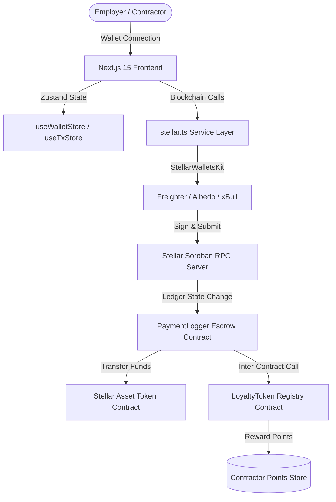
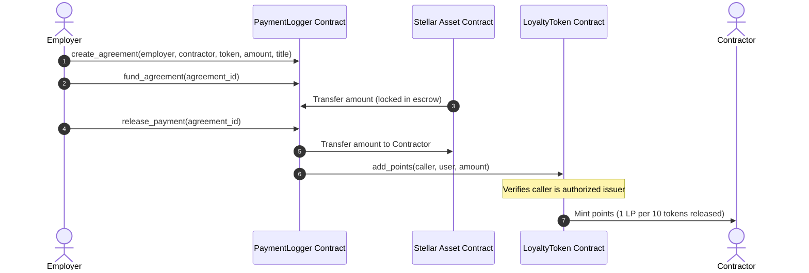
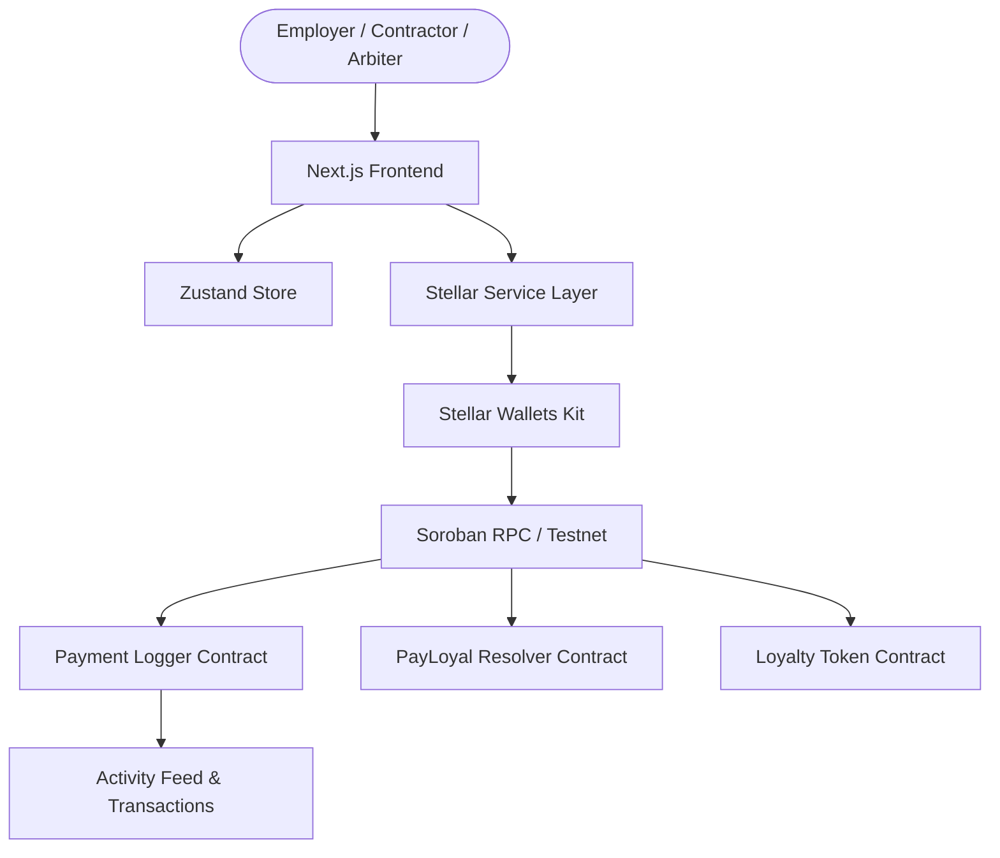

# 🌟 Stellar Journey to Mastery

> A hands-on Stellar journey through 7 belts — from first wallet connection to launching on Mainnet.
---

🚀 Project is live at https://stellar-journey-to-mastery.vercel.app/

---

## ⚪️ Level 1 — White Belt: Simple Payment dApp

### 📖 Overview

A beginner-friendly Stellar dApp covering the core fundamentals:
- Connect and disconnect a **Freighter** browser wallet
- View your **Public Key** and live **XLM balance**
- Send **XLM payments** to any Stellar address on testnet
- Real-time **transaction feedback** — success/failure + transaction hash

### 🚀 Features

- ✅ Freighter wallet connect / disconnect
- ✅ Public key display after connection
- ✅ XLM balance fetch with manual refresh
- ✅ Send XLM to any recipient address with custom amount
- ✅ Transaction success/failure feedback with hash confirmation
- ✅ Clean two-panel UI built with Tailwind CSS

### 🛠️ Tech Stack

| | |
|---|---|
| **Frontend** | React (Create React App) |
| **Styling** | Tailwind CSS |
| **Wallet** | Freighter (`@stellar/freighter-api`) |
| **Stellar SDK** | `@stellar/stellar-sdk` |
| **Network** | Stellar Testnet |

### 📸 Screenshots

#### Not Connected — Default State


#### Wallet Connected — Public Key & Balance Visible


#### Successful Testnet Transaction


#### Transaction Result Shown to User


### ✅ Level 1 Checklist

- [x] Freighter wallet connect + disconnect
- [x] Public key displayed after connection
- [x] XLM balance fetched and displayed (with refresh)
- [x] Send XLM transaction on Stellar testnet
- [x] Transaction feedback — success/failure + transaction hash

---

---

## 🟡 Level 2 — Yellow Belt: Payment Tracker & Soroban Logger

### 📖 Overview

Level 2 extends the White Belt functionality with multi-wallet support, a deployed Soroban smart contract, and real-time on-chain state synchronization:

- **Multi-Wallet Support** — Powered by `@creit.tech/stellar-wallets-kit`, supporting Freighter, Albedo, Hana, and LOBSTR
- **On-Chain Logging** — A custom Soroban Rust smart contract deployed on Testnet to record payment actions
- **Frontend Invocation** — Calls contract functions (`log_payment`, `fetch_payment`, `get_count`) directly from the browser
- **State Synchronization** — Automatically polls the smart contract to render on-chain logs in real-time
- **Error Handling** — Clean, user-friendly error normalization for Wallet Not Found, Transaction Rejected, and Insufficient Balance

### 🚀 Features

- ✅ Multi-wallet support (Freighter, Albedo, Hana, LOBSTR)
- ✅ Soroban smart contract deployed on testnet
- ✅ Contract functions called from frontend (`log_payment`, `fetch_payment`, `get_count`)
- ✅ Real-time on-chain log polling & state sync
- ✅ 3 error types handled — Wallet Not Found, Transaction Rejected, Insufficient Balance
- ✅ Transaction status tracking (pending / success / fail)

### 🛠️ Tech Stack

| | |
|---|---|
| **Frontend** | React (Create React App) |
| **Styling** | Tailwind CSS |
| **Wallet Kit** | `@creit.tech/stellar-wallets-kit` |
| **Smart Contract** | Soroban (Rust) |
| **Stellar SDK** | `@stellar/stellar-sdk` |
| **Network** | Stellar Testnet |

### 📋 Deployed Contract Information

| | |
|---|---|
| **Contract ID** | `CA2CPOMEE7EBGSSVU62T6HLG44WDOVEZAGTQGVW3KGV6PJ62R765IJEJ` |
| **Deploy Transaction Hash** | `0752486cadc7647292643dc425b4dff462daf2ad78cf7b94e8ed4027d46dbdd7` |
| **Contract Call Hash** | `0e95ca7e83ecd2e58ffcd1055fbeef44db497a44f4a359cb8666ddf01a8b42af` |
| **Explorer** | [View on Stellar Expert Testnet](https://stellar.expert/explorer/testnet) |

### 📁 Project Structure

```
stellar-connect-wallet/
├── contracts/                  # Soroban Smart Contract (payment-logger)
├── public/                     # Public assets
├── src/
│   ├── components/
│   │   ├── Freighter.js        # Wallet kit & Horizon transaction logic
│   │   ├── contracts.js        # Soroban read/write transaction handlers
│   │   └── Header.js           # Main dashboard interface
│   ├── App.js                  # App entry component
│   └── index.js                # App root render
├── package.json
└── README.md
```

### ⚙️ Setup Instructions

#### Prerequisites

- [Node.js](https://nodejs.org/) v18+
- [Freighter Wallet](https://www.freighter.app/) browser extension (configured to **Testnet**)

#### Installation

```bash
# 1. Clone the repository
git clone https://github.com/sadiyamulani03/Stellar-Journey-to-Mastery.git
cd stellar-connect-wallet

# 2. Install dependencies
npm install

# 3. Start the development server
npm start
```

Open [https://localhost:3000](https://localhost:3000) in your browser.

#### Getting Testnet XLM

```
https://friendbot.stellar.org/?addr=YOUR_PUBLIC_KEY
```

Or fund via [Stellar Laboratory](https://laboratory.stellar.org/#account-creator?network=test).

### 📸 Screenshots

#### wallet options available:


---
### ✅ Level 2 Checklist

- [x] Public GitHub repository
- [x] Multi-wallet support (Freighter, Albedo, Hana, LOBSTR)
- [x] Soroban smart contract deployed on testnet
- [x] Contract called from frontend
- [x] 3 error types handled
- [x] Transaction status visible (pending / success / fail)
- [x] Real-time state synchronization
- [x] Minimum 2+ meaningful commits
- [x] Deployed contract address included
- [x] Verifiable transaction hash included

---

## 🙏 Acknowledgements

- [Stellar Development Foundation](https://stellar.org/)
- [Freighter Wallet](https://www.freighter.app/)
- [Stellar Wallets Kit](https://github.com/creit-tech/stellar-wallets-kit)
- [Stellar Laboratory](https://laboratory.stellar.org/)
- [Stellar Expert Explorer](https://stellar.expert/)
---

## 🟡 Level 3 — Orange Belt: payLoyal: Smart Escrow Payroll & Loyalty Rewards Protocol

payLoyal is a production-grade, decentralized payroll escrow and builder loyalty rewards protocol built on the Stellar network using Soroban smart contracts. It enables employers to fund payroll streams inside an autonomous escrow environment, secure milestone delivery, and programmatically distribute payments to contractors while automatically minting loyalty point tokens to reward contribution volume.

---

## Architecture Diagram

The following Mermaid diagram shows the overall system flow from the client application through the wallet manager, contract coordinator, and blockchain ledger.



---

## Smart Contract Design

The protocol is split into two co-dependent Soroban smart contracts to enforce clear separation of concerns, secure funds custody, and modular governance:

1. **Escrow Payroll Contract (`payment-logger`)**:
   - Manages agreement state transitions: `Created (0)` &rarr; `Funded / Active (1)` &rarr; `Completed (2)` / `Cancelled (3)`.
   - Safely locks employer-deposited tokens in the contract address and releases them to the contractor upon employer signature validation.
   - Triggers cross-contract executions to award loyalty tokens.
   - Features contract upgrade capabilities controlled strictly by the administrative role.

2. **Loyalty Token Registry (`loyalty-token`)**:
   - Maintains account-level loyalty points balance mappings in instance storage with automatic TTL extension.
   - Restricts adding points to authenticated, authorized contract addresses (like `payment-logger`) and administrative accounts.
   - Provides point burn/redemption mechanics signed by the point owner.
   - Features contract upgrade capabilities.

---

## Inter-Contract Communication Flow



---

## Features

- **Custom Storage Structures**: Uses typed Soroban structures for payroll agreements and key configurations.
- **Advanced Access Control**: Employs role-based checks, administrative owner overrides, and strict verification logic.
- **Inter-Contract Routing**: Demonstrates secure contract-to-contract message calls and permission verification.
- **Transaction State Machine**: Tracks pending, processing, confirmed, and failed transactions locally.
- **StellarWalletsKit Integration**: Supports Freighter, Albedo, Hana, and Lobstr wallets with network auto-switching capabilities.
- **Mobile Responsive Design**: Clean dark-mode dashboard usable on desktop, tablet, and mobile browsers.

---

## Tech Stack

- **Smart Contracts**: Rust, Soroban SDK (v26)
- **Frontend Core**: Next.js 15, React 19, TypeScript
- **Styling**: Tailwind CSS
- **State Management**: Zustand
- **Service Queries**: React Query
- **Testing**: Vitest, React Testing Library, Soroban Mock SDK

---

## Local Development

### 1. Smart Contract Setup & Tests

To run smart contract tests locally:
```bash
# Run tests for all workspace contracts
cargo test --workspace
```

### 2. Frontend Setup

Ensure you have Node.js 18+ installed. Install dependencies and start the local development server:
```bash
# Install packages
npm install --ignore-scripts

# Start Next.js development server
npm run dev
```

Open [http://localhost:3000](http://localhost:3000) in your browser.

---

## Environment Variables

Create a `.env.local` file in the root directory:
```env
NEXT_PUBLIC_RPC_URL=https://soroban-testnet.stellar.org
NEXT_PUBLIC_HORIZON_URL=https://horizon-testnet.stellar.org
NEXT_PUBLIC_ESCROW_CONTRACT_ID=CA2CPOMEE7EBGSSVU62T6HLG44WDOVEZAGTQGVW3KGV6PJ62R765IJEJ
NEXT_PUBLIC_LOYALTY_CONTRACT_ID=CCIWJOKEYK623T4O72D6Q3W4H5LSPYCRQ6Z47VQDTRMEYV3JCPXU636F
```

---

## Testing

To run the frontend test suite:
```bash
# Run Vitest test suite
npm run test
```

---

## CI/CD Pipeline

The pipeline uses GitHub Actions to verify pull requests and automate deployments.

1. **Pull Request Workflow (`pr.yml`)**:
   - Checks out repository
   - Installs Rust and builds WASM contracts
   - Executes Cargo contract tests
   - Installs Next.js dependencies and runs Vitest unit tests

2. **Deployment Workflow (`deploy.yml`)**:
   - Triggered on merges to the `main` branch
   - Compiles and tests smart contracts
   - Builds Next.js production bundles and uploads to server environments

---

## Security Considerations

- **Input Sanitization**: Client forms validate addresses and positive decimals before transaction construction.
- **Authentication Safeguards**: All state-modifying smart contract calls require explicit `require_auth` checks on the employer signature.
- **Authorized Issuers Only**: The `loyalty-token` contract only mints points when invoked by approved addresses present in contract storage, preventing malicious point inflation.
- **Contract Code Upgradability**: Code updates are governed strictly by the admin key utilizing secure WASM hash upgrades.

---

## Contract Addresses

- **Escrow Payroll Contract ID**: `CA2CPOMEE7EBGSSVU62T6HLG44WDOVEZAGTQGVW3KGV6PJ62R765IJEJ`
- **Loyalty Registry Contract ID**: `CCIWJOKEYK623T4O72D6Q3W4H5LSPYCRQ6Z47VQDTRMEYV3JCPXU636F`

### Deployment Verification

- Verified against the Stellar Testnet Soroban RPC: the escrow contract address above responded successfully to a live simulation call.
- The loyalty and resolver defaults currently shown in the app should be replaced with valid deployed contract IDs if you want full multi-contract verification.

---

## Transaction Hash

- **Sample initialization transaction hash**: `5df7e47265bf87e974acdae98d7ceb9706e2a222378a5e4d29388dfba4a8f9cd`

---

### 📸 Screenshots

#### Mobile responsive UI:


#### CI/CD pipeline running:


#### Test output with 3+ passing tests:


---

## Demo Video

- **Demo Video Link**: https://drive.google.com/file/d/1fn-VlZfCmAQ7Mpz55Zu7gdC8ohb799il/view?usp=sharing

---

## Live

- **Live Link**: https://stellar-journey-to-mastery-1kzbuwjcw-sadiyamulani03s-projects.vercel.app/

---

## 🟢 Level 4 — Green Belt: payLoyal V2 

> A production-style Stellar payroll escrow and dispute platform built with Soroban, Next.js, and wallet-native UX.

---

## 📖 Overview

payLoyal V2 is a Green Belt submission project that brings together payroll streaming, dispute handling, and modern wallet interaction on the Stellar network. The product is designed to feel like a real startup MVP where employers can fund and manage ongoing wage streams while contractors can withdraw earned funds and raise disputes when required.

This version focuses on usability, reliability, and a polished demo experience rather than a simple tutorial implementation.

---

## 🚀 What This MVP Delivers

- Real-time payroll streaming with pause and resume support
- Escrow-based wage withdrawals for contractors
- Dispute creation and arbiter voting flow
- Live Soroban event-driven activity feed
- Transaction lifecycle tracking for pending, processing, confirmed, and failed states
- Responsive dashboard for desktop, tablet, and mobile screens
- Lightweight analytics and monitoring hooks for product usage

---

## 🧩 Core Features

### Product Experience
- Connect a Stellar wallet with a smooth onboarding experience
- Create and manage payroll streams from the dashboard
- Track activity and transaction history in one place
- Review dispute status and participate in resolution flows

### Smart Contract Logic
- Escrow-based stream lifecycle management
- Secure withdrawal logic for earned wages
- Dispute locking and resolution state handling
- Event emission for frontend mirrors and activity tracking

### Frontend Quality
- Modern UI with Tailwind styling
- Responsive layout and mobile-friendly navigation
- Clear state feedback for wallet and transaction actions
- Structured hooks and services for clean app logic

---

## 🛠️ Tech Stack

| Area | Stack |
|---|---|
| Frontend | Next.js 15, React 19, TypeScript |
| Styling | Tailwind CSS |
| State Management | Zustand, React Query |
| Wallet Integration | StellarWalletsKit |
| Smart Contracts | Rust, Soroban |
| Testing | Vitest, React Testing Library, Cargo tests |

---

## 🏗️ Architecture



---

## 📦 Smart Contract Design

The project uses three main contract areas:

1. Payment Logger Contract
   - Handles stream lifecycle steps
   - Locks and releases funds based on agreed actions
   - Supports dispute-triggered state changes

2. PayLoyal Resolver Contract
   - Supports dispute registration and voting
   - Enables arbiter participation and outcome resolution

3. Loyalty Token Contract
   - Tracks reward-style token behavior for loyalty or contribution incentives

---

## 📁 Project Structure

```bash
contracts/
  payment-logger/
  payloyal-resolver/
  loyalty-token/
src/
  app/
  components/
  hooks/
  services/
  store/
scripts/
```

---

## ⚙️ Local Development

### Prerequisites
- Node.js 18+
- Rust and Cargo
- A Stellar wallet such as Freighter

### Installation

```bash
npm install
npm run dev
```

Open http://localhost:3000 in your browser.

---

## 🧪 Testing

### Frontend

```bash
npm run test
```

### Smart Contracts

```bash
cargo test --workspace
```

---

## 🔐 Environment Variables

Create a local environment file using [.env.example](.env.example) as a template:

```env
NEXT_PUBLIC_ESCROW_CONTRACT_ID=
NEXT_PUBLIC_RESOLVER_CONTRACT_ID=
NEXT_PUBLIC_LOYALTY_CONTRACT_ID=
NEXT_PUBLIC_RPC_URL=https://soroban-testnet.stellar.org
NEXT_PUBLIC_HORIZON_URL=https://horizon-testnet.stellar.org
```

The frontend service layer already provides default contract IDs for the current development flow, but custom deployment values should be set for production-style demos.

---

## 🚀 Deployment and Demo Notes

- The app is structured for Stellar Testnet deployment
- Contract addresses should be updated in the environment configuration before a public demo
- The dashboard is designed to support a clean live walkthrough for judges, reviewers, and evaluators

---

## 📸 Screenshots:
- Product UI screenshot:-
  

- Mobile responsive view:-
  
  

- Analytics or monitoring view:-

---

## 🎥 Demo Video:

---

## 🔗 Live Demo: https://stellar-journey-to-mastery.vercel.app/
---

## 🙏 Acknowledgements

- Stellar Development Foundation
- Stellar Wallets Kit
- Soroban community tooling
- Open-source contributors and the broader Stellar ecosystem
